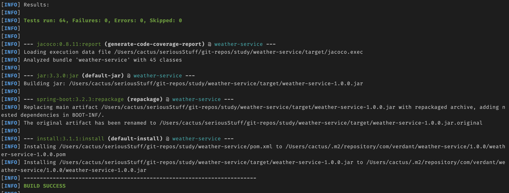
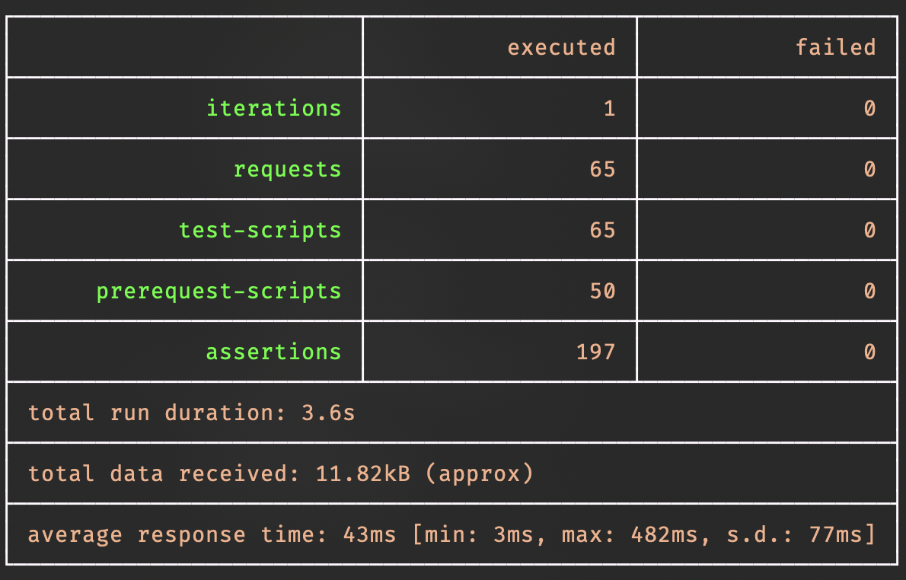
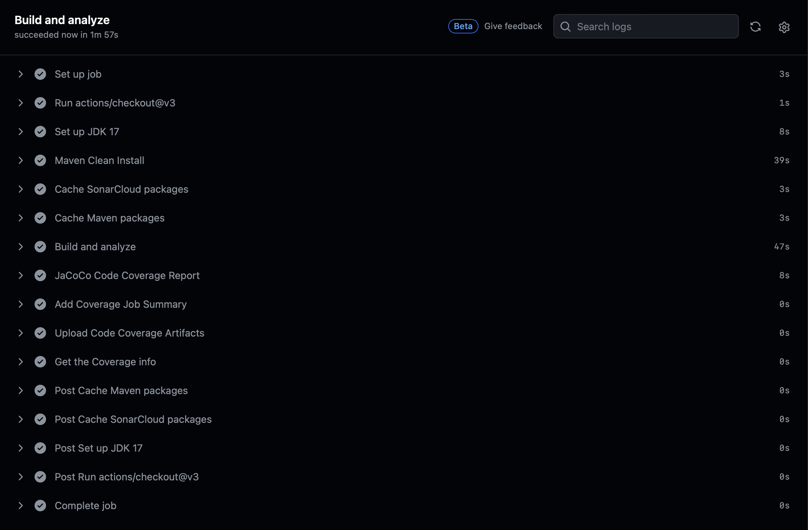
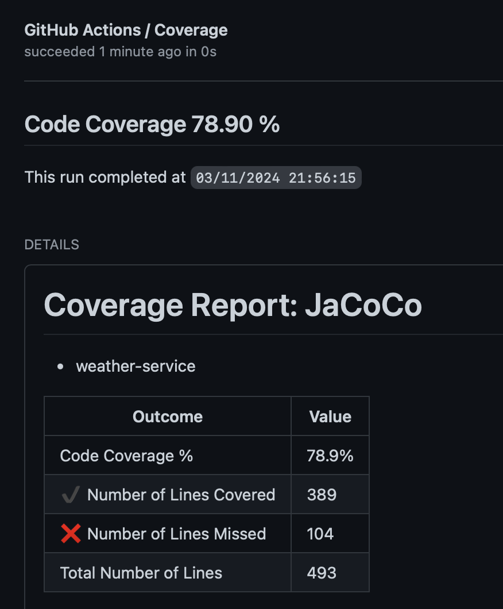
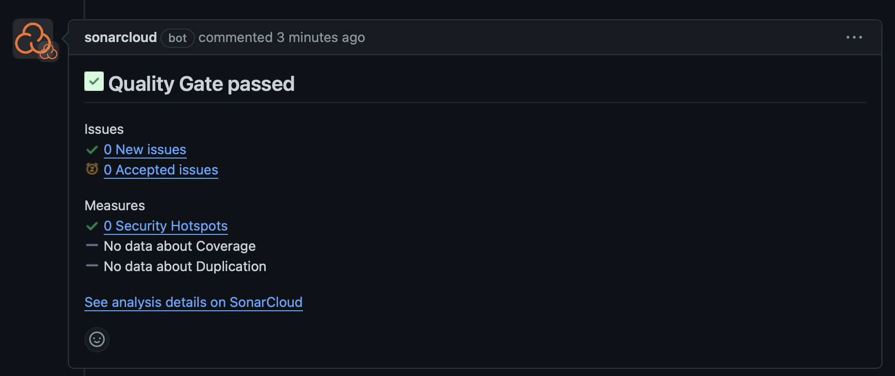
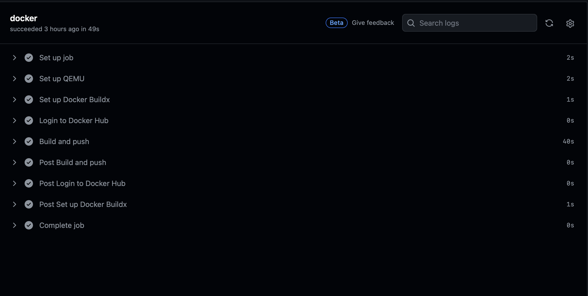
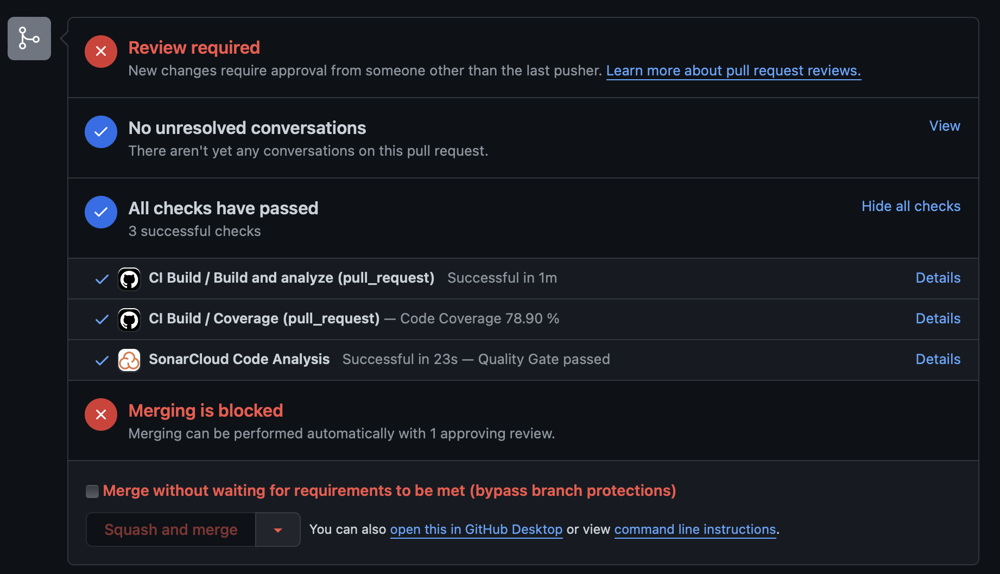

# Weather Service

Java application built with Spring Boot and Maven. It allows users to retrieve current weather conditions by city name, zip code, or coordinates using the OpenWeatherMap API.

## Table of Contents

- [Introduction](#introduction)
- [Prerequisites](#prerequisites)
- [Setup](#setup)
- [API Documentation](#api-documentation)
- [Current Weather Endpoints](#current-weather-endpoints)
- [Search Tracker Endpoints](#search-tracker-endpoints)
- [Testing](#testing)
- [Deployment and CI Pipeline](#deployment-and-ci-pipeline)
- [Design Decisions](#design-decisions)
- [TODO and Future Enhancements](#todo-and-future-enhancements)
- [Contributing](#contributing)
- [License](#license)

## Hosting Details:
> The application is hosted online using DigitalOcean and can be accessed via the following URL: http://bytemetwice.ninja
> 
> **Note**: It's important to note that the Secure Sockets Layer (SSL) is currently not implemented, hence, the application should be accessed using the HTTP protocol.
> 
> The application is deployed on a DigitalOcean droplet utilizing Docker technology for containerization. The Docker image, sourced from Docker Hub, facilitates a streamlined deployment process using `docker-compose.yml` file.


## Introduction

Java application built with the Spring Boot framework and managed with Maven. It leverages the OpenWeatherMap API and the Search Tracker API to provide users with current weather conditions and search tracking capabilities. Users can retrieve weather information by specifying a city id, name (state code and country code are optional parameter which can added with name parameter), zip code (country code is optional parameter which can added with zip code parameter), or geographical coordinates.

The application is designed with a focus on simplicity and ease of use, making it accessible for users of all technical levels. It is also highly scalable and supports custom caching mechanism, making it suitable for use in high-traffic environments.

The project structure is flexible and modular, designed to support future enhancements without much effort. This makes it easy to add new features or modify existing ones, ensuring the application can adapt to changing requirements and stay up-to-date with the latest industry standards.

The Weather Service application is part of a larger effort to provide accessible and accurate weather information to the public, contributing to safety and planning efforts worldwide. 


## Prerequisites

Before you begin, ensure you have the following prerequisites installed:

- Java Development Kit (JDK) 17 or later
- Spring Boot (Start Here: https://start.spring.io)
- Maven (for building and managing dependencies)


## Setup

1. Clone the repository:
   ```bash 
   git clone https://github.com/BytePiston/weather-service
    ```
      
2. Navigate to the project directory:
    ```bash 
    cd weather-service
    ```
   
3. If you have Docker installed, you can use Docker Compose to start the application:
    ```bash
    docker compose up --build
    ```

## API Documentation


The Weather Service application uses both Swagger and Bump for Open API documentation. Before making any requests, please visit the Swagger UI or Bump UI to view the API contracts. Both interfaces provide a user-friendly way to explore the API endpoints.

**The Open API documentation is hosted on Bump.sh and can be accessed at the following URL:**

```bash
    https://bump.sh/bytepiston/hub/weather-service/doc/weather-service-api
  ```

**You can access the Swagger UI at the following URL when running the application locally:**

```bash
    http://localhost:8080/swagger-ui.html
  ```
#### Auto-Generating Open API Documentation with GitHub Actions

The workflow defined in the `.github/workflows/bump.yml` file is responsible for auto-generating the API documentation and updating it on Bump.sh when changes are merged to the master branch. Here's how it works:  

- The workflow is triggered on a `push` event to the `master` branch.

- The `deploy-doc` job is executed when the event is a `push`. This job is responsible for deploying the API documentation on `Bump.sh`.

- If there are any changes in the `api-documentation.yml` file, the updated API documentation will be deployed on Bump.sh.

- This workflow ensures that the API Contract Documentation is always up-to-date with the latest contracts in the master branch.


## Current Weather Endpoints

To retrieve weather information, make a GET request to the appropriate endpoint with the required parameters. 

#### Supported API Requests:

- **To get weather by city ID:** This endpoint requires the ID of the city as a parameter. The ID should be a string value: 
   ```bash 
   GET api/v1/current/weather/city?id={id}
    ```
  
- **To get weather by city name**: This endpoint requires the name of the city as a parameter. The name should be a string value:
   ```bash
   GET api/v1/current/weather/city?name={cityName}
    ```
  
- **To get weather by city name and state code**: This endpoint requires the name of the city and the state code as parameters. Both should be string values:
   ```bash
  GET api/v1/current/weather/city?name={cityName}&stateCode={stateCode}
    ```
  
- **To get weather by city name, state code, and country code**: This endpoint requires the name of the city, the state code, and the country code as parameters. All should be string values: 
   ```bash
  GET api/v1/current/weather/city?name={cityName}&stateCode={stateCode}&countryCode={countryCode}
    ```
    
- **To get weather by zip code**: This endpoint requires the zip code as a parameter. The zip code should be a string value:
   ```bash
  GET api/v1/current/weather/zip?zipCode={zipCode}
    ```
    
- **To get weather by zip code and country code**: This endpoint requires the zip code and the country code as parameters. Both should be string values:
   ```bash
   GET api/v1/current/weather/zip?zipCode={zipCode}&countryCode={countryCode}
    ```  

- **To get weather by coordinates**: This endpoint requires the latitude and longitude as parameters. Both should be double values:
   ```bash
   GET api/v1/current/weather/coordinates?latitude={latitude}&longitude={longitude}
    ```
  
#### NOTE: The application also supports POST as GET methods to retrieve the current weather. These methods are not required for the current implementation but can be used for future enhancements. The request body should be a JSON object with the required parameters. For example:

- **To get weather by city parameters**: This endpoint requires a JSON object with either the ID or the name of the city as required parameters. The state code and the country code are optional parameters:
   ```bash
   POST: api/v1/current/weather/city
  
   Request Body:
   // Either ID or Name is required to get the weather;
   {
    "id": "{id}", // Conditional Required Parameter
    "name":"{cityName}", // Conditional Required Parameter
    "stateCode":"{stateCode}", // Optional Parameter
    "countryCode":"{countryCode}" // Optional Parameter
   }
    ```
- **To get weather by zip code parameters**: This endpoint requires a JSON object with the zip code as a required parameter. The country code is an optional parameter:

   ```bash
   POST api/v1/current/weather/zip 
  
   Request Body:
   
   {
    "zipCode": "{zipCode}", // Required Parameter
    "countryCode":"{countryCode}" // Optional Parameter
   }
    ```
- **To get weather by coordinates parameters**: This endpoint requires a JSON object with the latitude and longitude as required parameters:

   ```bash
   POST api/v1/current/weather/coordinates
  
   Request Body:
   
   {
    "latitude": "{latitude}", // Required Parameter
    "longitude":"{longitude}" // Required Parameter
   }
    ```
#### Current Weather Endpoint Sample API Response:

```bash
    {
    "currentWeather": {
        "coord": {
            "lon": -113.4687,
            "lat": 53.5501
        },
        "weather": [
            {
                "id": 801,
                "main": "Clouds",
                "description": "few clouds",
                "icon": "02d"
            }
        ],
        "base": "stations",
        "main": {
            "temp": 7.88,
            "feels_like": 6.26,
            "temp_min": 6.44,
            "temp_max": 8.32,
            "pressure": 1004,
            "humidity": 48
        },
        "visibility": 10000,
        "wind": {
            "speed": 2.57,
            "deg": 50
        },
        "clouds": {
            "all": 20
        },
        "dt": 1710196118,
        "sys": {
            "type": 1,
            "id": 642,
            "country": "CA",
            "sunrise": 1710165405,
            "sunset": 1710207053
        },
        "timezone": -21600,
        "id": 5946768,
        "name": "Edmonton",
        "cod": 200
    },
    "message": "SUCCESS"
}
  ```

## Search Tracker Endpoints: Provides Analytics for Weather Data Searches 

The Weather Service application provides endpoints for tracking the number of times a city's weather data is searched for by id, name, zip code, or coordinates. This feature supports analytics by incrementing the count for each search parameter every time a weather data request is made. Users can view the total count for a city and the count for each search parameter.

The `SearchTrackerController` class in the `com.verdant.weather.service.controller` package contains the implementation details of these endpoints.

- To get city search tracker data for all cities: This endpoint does not require any parameters:
   ```bash
   GET: /api/v1/tracker/city
  
#### Parameters

- `name`: The name of the city. This is an optional field.
- `page`: The page number for pagination. This is an optional field with a default value of 0.
- `pageSize`: The number of entries per page for pagination. This is an optional field with a default value of 10.

#### Search Tracker Endpoint Sample API Response:

```bash
GET: /api/v1/tracker/city?name={cityName}

[
    {
        "name": "edmonton",
        "idCount": 2,
        "nameCount": 7,
        "zipCodeCount": 0,
        "totalCounter": 9
    }
]
````

```bash
GET: /api/v1/tracker/city

[
    {
        "name": "Edmonton",
        "idCount": 2,
        "nameCount": 7,
        "zipCodeCount": 0,
        "totalCounter": 9
    },
    {
        "name": "Hudson",
        "idCount": 0,
        "nameCount": 0,
        "zipCodeCount": 4,
        "totalCounter": 4
    },
    {
        "name": "Leitchfield",
        "idCount": 0,
        "nameCount": 0,
        "zipCodeCount": 0,
        "totalCounter": 2
    }
]
```

## Search Tracker Endpoints

#### Supported API Requests:

- **To get city search tracker data for all cities**: This endpoint retrieves analytical data for all cities. It tracks the number of times each city's weather data has been searched for by id, name, zip code, or coordinates. This endpoint does not require any parameters:
    ```bash
    GET: /api/v1/tracker/city
    ```
  
- **To get city search tracker data with pagination**: This endpoint retrieves analytical data for all cities with pagination. The page number and the number of entries per page are required as parameters. Both should be integer values. The page number starts from 0 and the page size determines the number of entries per page:
    ```bash
    GET: /api/v1/tracker/city?page=0&pageSize=10
    ```
- **To get city search tracker data for a specific city**: This endpoint retrieves analytical data for a specific city. It requires the name of the city as a parameter. The name should be a string value. It tracks the number of times the specified city's weather data has been searched for by id, name, zip code, or coordinates:
    ```bash
    GET: /api/v1/tracker/city?name=cityName
    ```
  
- **To get city search tracker data for a specific city with pagination**: This endpoint retrieves analytical data for a specific city with pagination. It requires the name of the city, the page number, and the number of entries per page as parameters. The name should be a string value, and the page number and the number of entries per page should be integer values. The page number starts from 0 and the page size determines the number of entries per page:
    ```bash
    GET: /api/v1/tracker/city?name=cityName&page=0&pageSize=10
    ```  

#### Sample API Response:

```bash
    {
      "cityName": "string",
      "totalSearchCount": 0,
      "searchCountByCityId": 0,
      "searchCountByCityName": 0,
      "searchCountByZipCode": 0,
      "searchCountByCoordinates": 0
    }
  ```
Please note that the Search Tracker API is for internal use only and is not exposed to end users.

## Testing

This project uses a comprehensive testing approach to ensure reliability and robustness. Both JUnit and Postman are used for testing, covering a wide range of scenarios and edge cases.

1. **JUnit**: Unit tests have been added to test the Controllers, Services, and other functional classes. These tests ensure that each unit of the application works as expected independently. The extensive coverage of unit tests in this project demonstrates a commitment to quality and reliability. To run the JUnit tests, use the command:
    ```bash
    mvn test
    ```
   
2. **Postman**: A Postman collection has been added for automated testing of the API endpoints. This collection includes around 200 test cases that cover both positive and negative scenarios for each endpoint. The extensive number of test cases in the Postman collection reflects the effort put into ensuring that the API behaves as expected under a wide range of conditions. It's recommended to familiarize yourself with this Postman collection to understand the full range of functionality and edge cases for each endpoint. To test the API endpoints, you can import the Postman collection included in the repository and run the requests.

3. **Running Postman Collection with Newman and Environment Variables**: Newman is a command-line collection runner for Postman. It allows you to run and test a Postman collection directly from the command-line. You can also specify an environment file to use environment variables in your tests.

  - Install Newman globally with npm:

      ```bash
      npm install -g newman
      ```

  - Run your Postman collection with environment variables:

      ```bash
      newman run path_to_your_postman_collection.json -e path_to_your_postman_environment.json
      ```

Replace `path_to_your_postman_collection.json` and `path_to_your_postman_environment.json` with the paths to your Postman collection and environment files, respectively.

### Test Case Screenshots

Below are some screenshots of the test cases for this project:




**Maven Build Result with Junit Pass Status**




**Postman Collection  Execution Report**


## Deployment and CI Pipeline

This project uses Docker for deployment and GitHub Actions for the Continuous Integration (CI) pipeline.

### Deployment with Docker

Docker-Compose.yml for defining and running multi-container Docker applications. With Compose, you use a YAML file to configure your application's services. In this project, I used Docker Compose to define our services, build our Docker images, and run our Docker containers.

The `docker-compose.yaml` file in the root directory of this project defines the services that make up the application. To start the services, run the following command in the project root:
  ```bash
  docker-compose up --build
  ```
### Continuous Integration with GitHub Actions
The project uses GitHub Actions for the CI pipeline. This pipeline automates the build, test, and analysis process every time changes are pushed to the repository or a pull request is created.

The CI pipeline includes checks for SonarQube and Docker image publishing to Docker Hub. A pull request is allowed to merge only if all checks pass.

The `build.yml` file in the `.github/workflows` directory defines the CI pipeline. It includes steps for setting up the Java Development Kit (JDK), running Maven commands, caching SonarCloud and Maven packages, running SonarCloud analysis, generating the JaCoCo code coverage report, and publishing the Docker image to Docker Hub.

Code coverage is tracked using JaCoCo. The CI pipeline generates a code coverage report for each build and publishes it as a check run. This helps to ensure that the test coverage remains high and that the code quality is maintained.

To see the results of the CI pipeline, go to the `Actions` tab in the GitHub repository.

### CI Pipeline Screenshots

Below are some screenshots of the CI pipeline for this project:




**Maven Build and Test in CI Pipeline**




**JaCoCo Code Coverage Report in CI Pipeline**



**SonarQube Analysis in CI Pipeline**




**Docker Image Publishing in CI Pipeline**




**PR Status Checks has to pass before merging else PR will not be allowed to merge**


## Design Decisions

### POST as GET Methods

The application supports POST as GET methods to retrieve the current weather. These methods are not required for the current implementation but can be used for future enhancements. The request body should be a JSON object with the required parameters. This design decision was made to provide flexibility in how the API is used and to allow for more complex queries in the future.

### Use of Request and Response Model Classes

The use of `Request Model` classes for the `POST as GET` operation and the `Weather Response Model` contributes to the flexibility and modularity of the application, making it easier to accommodate future enhancements. Here's how:

1. **Separation of Concerns**: By using model classes to encapsulate the data for each request and response, the application separates the concerns of data handling from the business logic in the controller and service. This makes the code easier to understand and maintain.

2. **Code Reusability**: Model classes can be reused across different parts of the application. If a new feature requires the same data structure, the existing model class can be used instead of creating a new one.

3. **Ease of Modification**: If the data requirements for a request or response change in the future, only the relevant model class needs to be updated. The controller, service, and other parts of the application that use the model class will automatically get the updated data structure.

4. **Validation**: Request model classes can include validation logic to ensure that the data is in the correct format before it is processed by the controller. This helps to catch errors early and improves the robustness of the application.

5. **Flexibility**: Response model classes provide flexibility in how the API responses are structured. This is particularly useful when dealing with APIs like OpenWeatherMap, where the response data can be quite complex. By mapping the API response to a model class, the application can easily extract and use the data it needs.

6. **Documentation and Communication**: Both request and response model classes serve as a form of documentation, clearly showing what data is required for each request and what data is included in each response. This makes it easier for developers to understand the API and for teams to communicate about the application's requirements.

In the provided `CurrentWeatherController` class, the `CityRequestModel`, `ZipCodeRequestModel`, and `CoordinateRequestModel` are used to encapsulate the data for the POST as GET methods. These model classes make the application more flexible and modular, and they will be instrumental in accommodating future enhancements.

Similarly, in the `WeatherModel` class, the nested static classes like `Coord`, `Weather`, `Main`, `Wind`, `Rain`, `Clouds`, and `Sys` are used to encapsulate the data for the weather response. These model classes make the application more flexible and modular, and they will be instrumental in accommodating future enhancements.
In the provided `CurrentWeatherController` class, the `CityRequestModel`, `ZipCodeRequestModel`, and `CoordinateRequestModel` are used to encapsulate the data for the POST as GET methods. These model classes make the application more flexible and modular, and they will be instrumental in accommodating future enhancements.

### Use of OpenWeatherMap API Response Structure in WeatherModel

The `WeatherModel` class in this application is designed to mirror the response structure of the OpenWeatherMap API. This design decision was made for several reasons:

1. **Consistency**: By keeping the structure of the `WeatherModel` class similar to the OpenWeatherMap API response, the application maintains consistency with the API it is consuming. This makes it easier for developers who are familiar with the OpenWeatherMap API to understand the structure of the `WeatherModel` class.

2. **Ease of Integration**: Developers using this application as a service can easily integrate it with other services that consume the OpenWeatherMap API. Since the response structure is the same, they can reuse their existing data handling logic.

3. **Flexibility**: The `WeatherModel` class includes all the data fields provided by the OpenWeatherMap API. Even though the current implementation of the application may not use all these fields, they are available for future enhancements. This makes the application more flexible and adaptable to changing requirements.

4. **Transparency**: By using the same response structure, the application provides complete transparency about the data it is returning. Developers can refer to the OpenWeatherMap API documentation to understand the data fields in the `WeatherModel` class.

In the `WeatherModel` class, the nested static classes like `Coord`, `Weather`, `Main`, `Wind`, `Rain`, `Clouds`, and `Sys` are used to encapsulate the data for the weather response. These model classes make the application more flexible and modular, and they will be instrumental in accommodating future enhancements.

### Custom Cache Implementation
The Weather Service application implements a custom caching mechanism, a standout feature designed to enhance performance and efficiency. This mechanism, implemented using `ConcurrentHashMap`, is tailored to the constraints of the OpenWeatherMap API, which permits 60 requests per minute and refreshes data every 10 minutes. The cache operates with a Time To Live (TTL) strategy, based on the timestamp of the generated weather data.

The `CachedWeatherMap` class, an extension of `ConcurrentHashMap`, manages cache entries based on their TTL. When weather data is cached, the TTL is set to the data's generation time plus 10 minutes, aligning with the OpenWeatherMap API's refresh rate. Expired cache entries, those surpassing their TTL, are promptly removed, ensuring the cache only contains relevant data.
Here's why this custom cache implementation is beneficial:

1. **Performance Improvement**: By caching the weather data, the application reduces the number of API calls to the OpenWeatherMap API for repeated GET requests. This improves the performance of the application, especially in high-traffic environments.

2. **Efficiency**: The custom cache implementation ensures that the application uses the OpenWeatherMap API efficiently, adhering to the API request limit and data refresh rate.

3. **Cost-Effective**: Reducing the number of API calls can also help to minimize costs, especially if the API provider charges based on the number of requests.

4. **User Experience**: By caching the data, the application can provide faster responses to the users, enhancing the user experience.

5. **Control Over TTL**: The custom cache implementation provides more control over the TTL of the cache entries. If the TTL of a cache entry has passed, the entry is removed from the cache and new data is retrieved and added back to the cache. This ensures that the application always provides the most up-to-date weather information to the users while making efficient use of the API.

The `CachedWeatherMap` class in the `com.verdant.weather.service.config` package contains the implementation details of this custom cache.


## TODO and Future Enhancements

### Short Term Goals

- Deploy Docker image to a cloud hosting platform through GitHub Actions workflow.
- Integrate Fortify and BlackDuck to scan the codebase for security vulnerabilities.
- In CityTrackerController and CityTrackerService, add implementation of endpoints to support additional analytics and tracking features.
- Add more junit for Model, Entity classes to increase overall code coverage.
- Run postman collection with Newman and environment variables as part of the CI/CD pipeline to automate testing.
- Add support for additional weather APIs (e.g., Future Weather, Historical Weather, etc.).
- Integrate Redis or Memcached for distributed caching to support scalability and high-traffic environments.
- Validate all inputs to prevent SQL injection, cross-site scripting (XSS), and other common web attacks.
- Use a consistent logging format to make it easier to search and analyze the logs.
- Integrate with a database to store City information such as ID, Name, Zip Code for enhanced validation to avoid unnecessary API calls to OpenWeatherMap in case of invalid city names or IDs
- Integrate with a database to store historical weather data

### Long Term Goals

- Implement a rate limiter to prevent abuse of the API and ensure fair usage
- Add support for multiple languages in the API responses
- Integrate ELK (Elasticsearch, Logstash, Kibana) for log aggregation and analysis.
- Use Spring Boot Actuator to expose metrics like JVM memory usage, CPU usage, request count, error count, etc.
- Integrate with a monitoring system like Prometheus and Grafana to collect, store, and visualize these metrics.
- Implement Spring Security to secure the application endpoints.
- Implement a notification system for weather alerts and updates

## Contributing

Contributions are welcome. Please fork the repository and create a pull request with your changes.

## License

This project is licensed under the MIT License.
